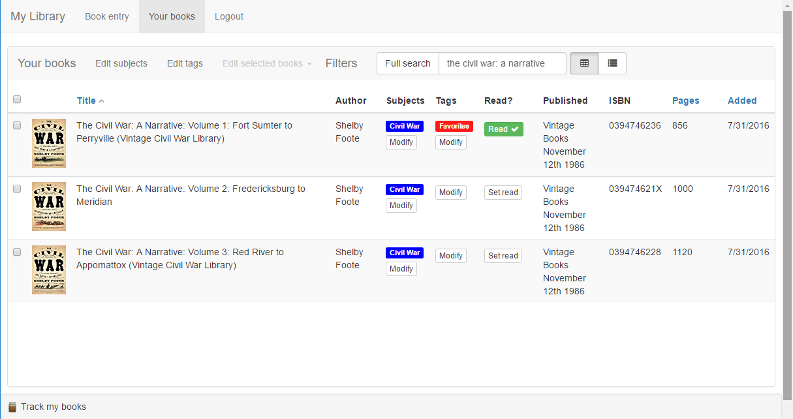
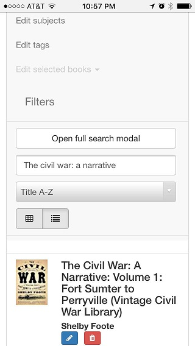

# booklist

A fully functioning book collection website hosted at http://mylibrary.io/ 

I made this as a way to learn and try out modern development tools I'm interested in, and also to track my own library. Progress is limited to whatever time I can find, which means parts of this may be incomplete at any given time.  Currently you can create an account; scan in books, which are looked up via AWS; and view, edit, filter, and tag your books with (hierarchical) subjects as desired.

It looks something like this 

and there's a somewhat decent mobile view

---

I initially made this with the goal of creating iterations of the site with React, Angular, Aurelia, etc. So far I've felt no desire to leave React or stop iterating on the (single) React iteration. Nonetheless, it's designed so that all iterations will share the same data, data access, controllers, and AWS access code.  Controllers are sniffed out and wired with my [easy-express-controllers 
](https://www.npmjs.com/package/easy-express-controllers) project; data access is through Mongo; and all book info is looked up with my own AWS credentials, subject to an unfortunate one-request-per-second limit imposed by Amazon.

The current React iteration uses Redux and Bootstrap, and is in the react-redux directory.  ES6 transpilation is through Babel, with Stage 2 features enabled for things like object spread.  React-Bootstrap is currently used to get things like Modal, NavBar and Collapse working, although I plan on replacing it with my own, smaller [simple-react-bootstrap](https://www.npmjs.com/package/simple-react-bootstrap) project. I've also added react-dropzone to support uploading book cover images (for when AWS doesn't have it for some reason), and sooner or later I'll get around to adding D3 to mess around with data visualization.

Future iterations may potentially look at ... whatever is thriving whenever the React version is done, if it ever is...